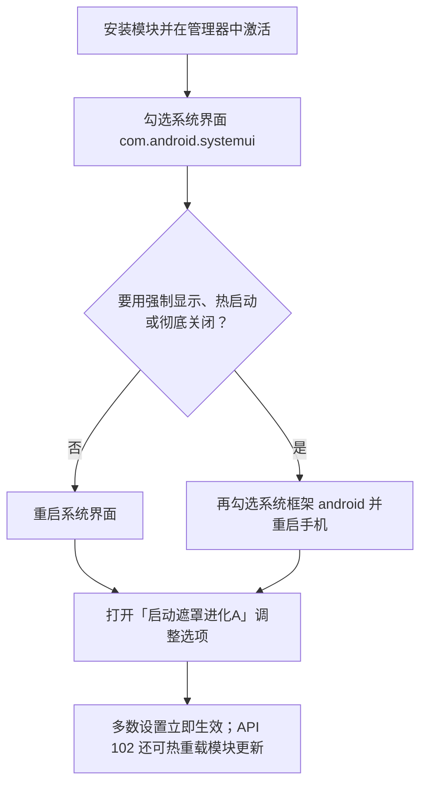

<div align="center">


# SplashScreenAdvanced

**启动遮罩进化A**

自定义 Android 原生 Splash Screen 的 [libxposed](https://github.com/libxposed) 模块

<br>

[](LICENSE)
[](#要求)
[](https://github.com/libxposed)
[](https://kotlinlang.org)
[](https://github.com/jichuo1/SplashScreenAdvanced/releases)
[](https://github.com/jichuo1/SplashScreenAdvanced/issues)

[功能](#功能) · [要求](#要求) · [使用](#使用) · [构建](#构建) · [反馈](#反馈) · [许可](#出处与许可)

</div>

> [!NOTE]
> 本项目是 [GSWXXN/RestoreSplashScreen](https://github.com/GSWXXN/RestoreSplashScreen) 的修改版，以 AGPL-3.0 继续分发。详见 [出处与许可](#出处与许可)。

---

## 功能

按模块设置页归类，改完多数选项会立刻热重载，不必重启。

<table>
<tr>
<td width="50%" valign="top">

#### 图标

- 强制使用原生 Splash Screen
- 遮罩图标跟随桌面 / 图标包 / 小米大图标
- 忽略应用主动适配的图标（可解方角）
- 隐藏图标、绘制圆角、缩小、模糊底、去描边

</td>
<td width="50%" valign="top">

#### 背景

- 从图标取色、莫奈取色或自定义颜色
- 浅色 / 深色 / 跟随系统，可逐应用单独配色
- 忽略小米强制深色背景
- 移除应用截图当背景的情况

</td>
</tr>
<tr>
<td width="50%" valign="top">

#### 显示

- 全局或逐应用最小持续时长
- 移除底部 Branding Image
- 强制显示、强制开启、热启动遮罩
- 彻底关闭 Splash Screen

</td>
<td width="50%" valign="top">

#### 作用域与模块

- 自定义作用域（排除 / 仅选中）
- 作用域外可替换为空白遮罩
- 备份与恢复设置
- 隐藏模块桌面图标、大屏双栏布局

</td>
</tr>
</table>

MIUI / HyperOS 与 ColorOS 走专门分支，其余系统走 AOSP 通用路径。

---

## 要求

| 项 | 说明 |
|:---|:---|
| **系统** | Android 14 及以上（`minSdk 34`） |
| **框架** | 实现 [libxposed](https://github.com/libxposed) **API 101** 的框架即可；**API 102** 额外支持热重载 |
| **作用域** | 至少勾选 **系统界面**（`com.android.systemui`） |
| **适配** | 重点覆盖 MIUI / HyperOS、ColorOS；其余 ROM 走通用路径 |

> [!NOTE]
> 框架只有 API 101 时，Hook 与设置热更新仍然可用，但模块 APK 更新后需要重启系统界面（勾了系统框架则重启手机）。API 102 会自动热重载，一般不必重启。

---

## 使用



### 作用域对照

| 功能 | 系统界面 | 系统框架 | 生效方式 |
|:---|:---:|:---:|:---|
| 图标 / 背景 / 时长 / 作用域等常规项 | 需要 | — | 改设置即时生效；API 101 下更新模块后需重启系统界面 |
| 强制显示遮罩 | 需要 | 需要 | 重启手机 |
| 热启动遮罩 | 需要 | 需要 | 须同时开启「强制开启启动遮罩」，并重启手机 |
| 彻底关闭 Splash Screen | — | 需要 | 重启手机；开启后模块内其余选项不再起作用 |

> [!WARNING]
> 「强制开启启动遮罩」只在模块已激活却完全不生效时再试。正常工作时不要打开，否则可能在不该出现的场景显示遮罩，或挡住应用自己设置的背景图。

> [!TIP]
> 「最小持续时长」会拖慢应用启动。没有明确需求就保持默认。

---

## 构建

需要 **JDK 21** 与 **Android SDK Platform 37**。

```bash
git clone https://github.com/jichuo1/SplashScreenAdvanced.git
cd SplashScreenAdvanced
./gradlew :app:assembleDebug
```

| 产物 | 命令 / 入口 |
|:---|:---|
| Debug APK | `./gradlew :app:assembleDebug` |
| Alpha 预发布 | 向 `main` 推送，或手动运行 [alpha-release](.github/workflows/alpha-release.yml) |
| Stable 发布 | [stable-release](.github/workflows/stable-release.yml) |

发布签名使用 GitHub Environment Secrets，密钥库不要放进仓库。步骤见 [release-signing](.github/release-signing/README.md)。

---

## 反馈

请先到 [Releases](https://github.com/jichuo1/SplashScreenAdvanced/releases) 确认已是最新版本，再提交 [Issue](https://github.com/jichuo1/SplashScreenAdvanced/issues)，并附上：

1. Android 版本、ROM 及版本号
2. Xposed 框架名称与版本（API 101 或 102）
3. 复现步骤，以及是否勾选了系统框架
4. 模块日志与框架日志：在设置中打开「启用日志」后复现（日志会在 24 小时后自动关闭）

日志里请去掉账号、路径等无关隐私后再上传。

---

## 出处与许可

本项目基于 [GSWXXN/RestoreSplashScreen](https://github.com/GSWXXN/RestoreSplashScreen)（作者 GSWXXN）修改而来。原作品与本仓库均以 [GNU Affero General Public License v3.0](LICENSE) 授权。

相对上游的主要变更包括：

- 模块包名与项目身份改为 `com.SplashScreenAdvanced.xposedmodule`
- Hook 层的异常隔离、反射缓存、内存与线程安全修复
- 设置界面重组与图标加载优化
- 发布流水线改为 GitHub Actions + Environment Secrets 签名

原作者的个人品牌素材、社区链接与捐赠信息已移除，它们指向的是原作者本人而非本项目。

## 致谢

| 项目 | 说明 |
|:---|:---|
| [GSWXXN/RestoreSplashScreen](https://github.com/GSWXXN/RestoreSplashScreen) | 上游项目 |
| [libxposed](https://github.com/libxposed) | 模块 API 与服务 |
| [KavaRef](https://github.com/HighCapable/KavaRef) | 运行期反射 |
| [DexKit](https://github.com/LuckyPray/DexKit) | 宿主类查找 |
| [BetterAndroid](https://github.com/BetterAndroid/BetterAndroid) | Android 系统扩展 |
| [miuix](https://github.com/miuix-kotlin-multiplatform/miuix) | 设置界面组件 |
| [hyperx-compose](https://github.com/HowieHChen/hyperx-compose) | HyperOS 风格 Compose 壳 |
| [Koin](https://github.com/InsertKoinIO/koin) | 依赖注入 |
| [Hide My Applist](https://github.com/Dr-TSNG/Hide-My-Applist) | 应用列表获取思路 |
| [MiuiHome_R](https://github.com/qqlittleice/MiuiHome_R) | 备份恢复逻辑参考 |
| [MIUINativeNotifyIcon](https://github.com/fankes/MIUINativeNotifyIcon) | 开源参考 |
| [YukiHookAPI](https://github.com/fankes/YukiHookAPI) | 开源参考 |

<div align="center">

<br>

**[AGPL-3.0](LICENSE)** · [Issues](https://github.com/jichuo1/SplashScreenAdvanced/issues) · [Releases](https://github.com/jichuo1/SplashScreenAdvanced/releases)

<sub>感谢原作者 GSWXXN，以及每一位提交 Issue 与参与测试的用户。</sub>

</div>
