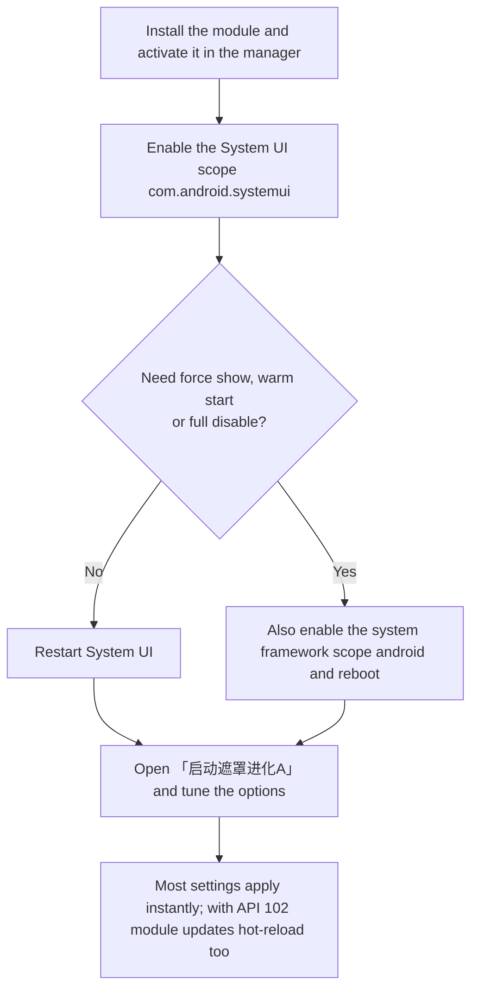

<div align="center">


# SplashScreenAdvanced

**启动遮罩进化A** (Splash Screen Advanced)

A [libxposed](https://github.com/libxposed) module that customizes the native Android Splash Screen

<br>

[简体中文](README.md) · **English**

<br>

[](LICENSE)
[](#requirements)
[](https://github.com/libxposed)
[](https://kotlinlang.org)
[](https://github.com/jichuo1/SplashScreenAdvanced/releases)
[](https://github.com/jichuo1/SplashScreenAdvanced/issues)
[](https://t.me/SplashScreenAdvanced)

[Features](#features) · [Requirements](#requirements) · [Usage](#usage) · [Build](#build) · [Feedback](#feedback) · [License](#origin--license)

</div>

> [!NOTE]
> This project is a modified version of [GSWXXN/RestoreSplashScreen](https://github.com/GSWXXN/RestoreSplashScreen) and is redistributed under AGPL-3.0. See [Origin & License](#origin--license).

---

## Features

Grouped by the module's settings pages. Most options hot-reload right after they are changed — no reboot needed.

<table>
<tr>
<td width="50%" valign="top">

#### Icon

- Force the native Splash Screen
- Splash icon follows the launcher / icon pack / Xiaomi large icons
- Ignore the icon an app adapts by itself (also fixes square corners)
- Hide the icon, draw rounded corners, shrink the icon, blurred backdrop, remove the stroke

</td>
<td width="50%" valign="top">

#### Background

- Color taken from the icon, Monet color extraction, or a custom color
- Light / dark / follow system, with per-app colors
- Ignore Xiaomi's forced dark background
- Remove app screenshots used as the background

</td>
</tr>
<tr>
<td width="50%" valign="top">

#### Display

- Global or per-app minimum duration
- Remove the bottom Branding Image
- Force show, force enable, and warm-start the splash screen
- Fully disable the Splash Screen

</td>
<td width="50%" valign="top">

#### Scope & Module

- Custom scope (exclude / only selected)
- Replace out-of-scope apps with a blank splash screen
- Back up and restore settings
- Hide the module's launcher icon, two-pane layout on large screens

</td>
</tr>
</table>

MIUI / HyperOS and ColorOS are handled by dedicated branches; other systems use the generic AOSP path.

---

## Requirements

| Item | Description |
|:---|:---|
| **System** | Android 14 or later (`minSdk 34`) |
| **Framework** | Any framework implementing [libxposed](https://github.com/libxposed) **API 101**; **API 102** additionally supports hot reload |
| **Scope** | At least the **System UI** scope (`com.android.systemui`) must be enabled |
| **Adaptation** | Primarily covers MIUI / HyperOS and ColorOS; other ROMs use the generic path |

> [!NOTE]
> With an API 101-only framework, hooks and settings hot-update still work, but after the module APK is updated you need to restart System UI (or reboot the phone if the system framework scope is enabled). API 102 hot-reloads automatically, so a restart is usually unnecessary.

---

## Usage



### Scope reference

| Feature | System UI | System framework | How it takes effect |
|:---|:---:|:---:|:---|
| Regular options (icon / background / duration / scope, etc.) | Required | — | Applies as soon as a setting is changed; with API 101, restart System UI after updating the module |
| Force show splash screen | Required | Required | Reboot |
| Warm-start splash screen | Required | Required | Requires "Force enable splash screen" as well, then reboot |
| Fully disable Splash Screen | — | Required | Reboot; once enabled, the other options in the module stop working |

> [!WARNING]
> Only try "Force enable splash screen" when the module is activated but has no effect at all. Do not enable it while the module works normally, otherwise a splash screen may appear in scenarios where it should not, or it may cover a background image the app sets by itself.

> [!TIP]
> "Minimum duration" slows down app launches. Keep the default unless you really need it.

---

## Build

Requires **JDK 21** and **Android SDK Platform 37**.

```bash
git clone https://github.com/jichuo1/SplashScreenAdvanced.git
cd SplashScreenAdvanced
./gradlew :app:assembleDebug
```

| Artifact | Command / Entry point |
|:---|:---|
| Debug APK | `./gradlew :app:assembleDebug` |
| Alpha pre-release | Push to `main`, or run [alpha-release](.github/workflows/alpha-release.yml) manually |
| Stable release | [stable-release](.github/workflows/stable-release.yml) |

Release signing uses GitHub Environment Secrets — never put the keystore in the repository. Steps are in [release-signing](.github/release-signing/README.md).

---

## Feedback

For questions and general discussion, join the [Telegram group](https://t.me/SplashScreenAdvanced). When reporting a bug, please include the information below so it can be followed up.

Check the [Releases](https://github.com/jichuo1/SplashScreenAdvanced/releases) page first to confirm you are on the latest version, then open an [Issue](https://github.com/jichuo1/SplashScreenAdvanced/issues) with:

1. Android version, ROM and its version number
2. Xposed framework name and version (API 101 or 102)
3. Steps to reproduce, and whether the system framework scope is enabled
4. Module log and framework log: turn on "Enable log" in the settings, then reproduce (logging turns itself off after 24 hours)

Please strip account names, paths and other irrelevant private data from the logs before uploading.

---

## Origin & License

This project is based on [GSWXXN/RestoreSplashScreen](https://github.com/GSWXXN/RestoreSplashScreen) by GSWXXN. Both the original work and this repository are licensed under the [GNU Affero General Public License v3.0](LICENSE).

Main changes compared to upstream:

- Module package name and project identity changed to `com.SplashScreenAdvanced.xposedmodule`
- Exception isolation in the hook layer, reflection caches, memory and thread-safety fixes
- Reorganized settings UI and optimized icon loading
- Release pipeline moved to GitHub Actions with Environment Secrets signing

The original author's personal branding assets, community links and donation information have been removed, as they point to the original author rather than to this project.

## Credits

| Project | Description |
|:---|:---|
| [GSWXXN/RestoreSplashScreen](https://github.com/GSWXXN/RestoreSplashScreen) | Upstream project |
| [libxposed](https://github.com/libxposed) | Module API and services |
| [KavaRef](https://github.com/HighCapable/KavaRef) | Runtime reflection |
| [DexKit](https://github.com/LuckyPray/DexKit) | Host class lookup |
| [BetterAndroid](https://github.com/BetterAndroid/BetterAndroid) | Android system extensions |
| [miuix](https://github.com/miuix-kotlin-multiplatform/miuix) | Settings UI components |
| [hyperx-compose](https://github.com/HowieHChen/hyperx-compose) | HyperOS-style Compose shell |
| [Koin](https://github.com/InsertKoinIO/koin) | Dependency injection |
| [Hide My Applist](https://github.com/Dr-TSNG/Hide-My-Applist) | App list retrieval approach |
| [MiuiHome_R](https://github.com/qqlittleice/MiuiHome_R) | Backup & restore logic reference |
| [MIUINativeNotifyIcon](https://github.com/fankes/MIUINativeNotifyIcon) | Open-source reference |
| [YukiHookAPI](https://github.com/fankes/YukiHookAPI) | Open-source reference |

<div align="center">

<br>

**[AGPL-3.0](LICENSE)** · [Issues](https://github.com/jichuo1/SplashScreenAdvanced/issues) · [Releases](https://github.com/jichuo1/SplashScreenAdvanced/releases)

<sub>Thanks to the original author GSWXXN, and to everyone who reported issues and helped with testing.</sub>

</div>
